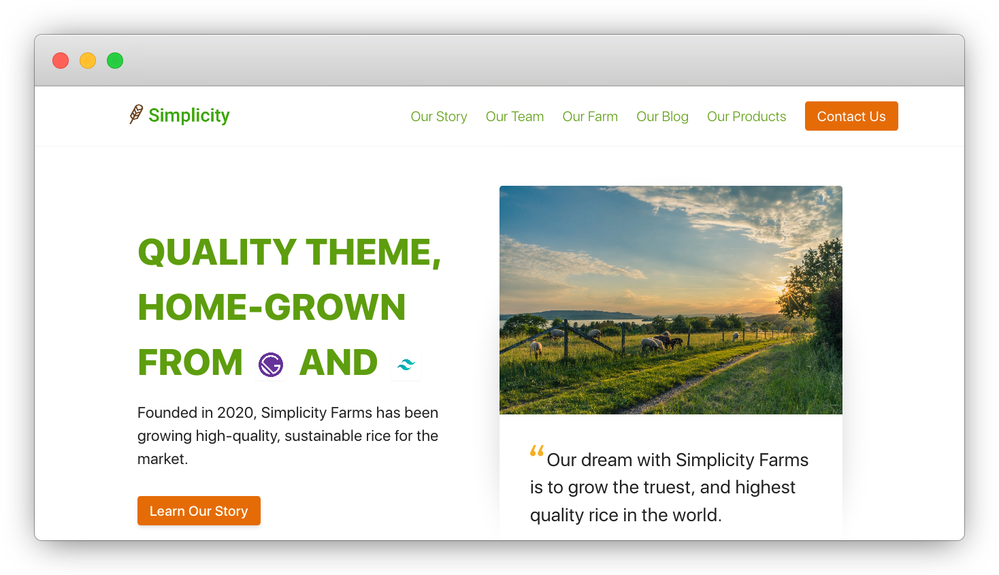

<p align="center">
  <a href="https://www.gatsbyjs.org">
    
  </a>
  &nbsp;&nbsp;
  <a href="https://tailwindcss.com">
    
  </a>
</p>
<h1 align="center">
  Simplicity Itself Gatsby/TailwindCSS Starter Theme
</h1>



A Simple, Free Gatsby/TailwindCSS Starter Theme For Business Websites.

### DEMO: [simplicity-itself.planflow.dev](https://simplicity-itself.planflow.dev)

#### Check Out Some Of Our Other Themes: [PlanFlow Free Themes](https://planflow.dev/free-themes/)

## 🚀 Quick start

1.  **Create a Gatsby site.**

    Use the Gatsby CLI to create a new site, specifying this starter.

    ```shell
    # create a new Gatsby site using this starter
    gatsby new my-tailwind-starter https://github.com/PlanFlowDev/Simplicity-Itself-Gatsby-Tailwind-Starter-Theme
    ```

    Or simply use the CLI to download it as an NPM package:

     ```shell
    # Run the following command in your CLI
    npm i gatsby-tailwind-simplicity-theme
    ```

1.  **Start developing.**

    Navigate into your new site’s directory and start it up.

    ```shell
    cd my-tailwind-starter/
    gatsby develop
    ```

1.  **Open the source code and start editing!**

    Your site is now running at `http://localhost:8000`!

    _Note: You'll also see a second link: _`http://localhost:8000/___graphql`_. This is a tool you can use to experiment with querying your data. Learn more about using this tool in the [Gatsby tutorial](https://www.gatsbyjs.org/tutorial/part-five/#introducing-graphiql)._

    Open the `my-tailwind-starter` directory in your code editor of choice and edit `src/pages/index.js`. Save your changes and the browser will update in real time!

## 🧐 What's inside?

A quick look at the top-level files and directories you'll see in this Gatsby / Tailwind project.

    .
    ├── .vscode
    ├── node_modules
    ├── src
    ├── .eslintrc
    ├── .gitignore
    ├── .prettierrc
    ├── gatsby-browser.js
    ├── gatsby-config.js
    ├── gatsby-node.js
    ├── gatsby-ssr.js
    ├── LICENSE
    ├── package-lock.json
    ├── package.json
    ├── postcss.config.js
    ├── README.md
    ├── tailwind.config.js
    └── yarn.lock

1. **`/.vscode`**: This directory contains two files: `extensions.json` and `settings.json`. The first is a list of recommended extensions to make working with this project a breeze. The second essentially tells VS Code to run `eslint` on save.

2. **`/node_modules`**: This directory contains all of the modules of code that your project depends on (npm packages) are automatically installed.

3. **`/src`**: This directory will contain all of the code related to what you will see on the front-end of your site (what you see in the browser) such as your site header or a page template. `src` is a convention for “source code”.

4. **`.eslintrc`**: This is a configuration file for [ESLint](https://eslint.org/). ESLint is a tool to help you write good JavaScript.

5. **`.gitignore`**: This file tells git which files it should not track / not maintain a version history for.

6. **`.prettierrc`**: This is a configuration file for [Prettier](https://prettier.io/). Prettier is a tool to help keep the formatting of your code consistent.

7. **`gatsby-browser.js`**: This file is where Gatsby expects to find any usage of the [Gatsby browser APIs](https://www.gatsbyjs.org/docs/browser-apis/) (if any). These allow customization/extension of default Gatsby settings affecting the browser.

8. **`gatsby-config.js`**: This is the main configuration file for a Gatsby site. This is where you can specify information about your site (metadata) like the site title and description, which Gatsby plugins you’d like to include, etc. (Check out the [config docs](https://www.gatsbyjs.org/docs/gatsby-config/) for more detail).

9. **`gatsby-node.js`**: This file is where Gatsby expects to find any usage of the [Gatsby Node APIs](https://www.gatsbyjs.org/docs/node-apis/) (if any). These allow customization/extension of default Gatsby settings affecting pieces of the site build process.

10. **`gatsby-ssr.js`**: This file is where Gatsby expects to find any usage of the [Gatsby server-side rendering APIs](https://www.gatsbyjs.org/docs/ssr-apis/) (if any). These allow customization of default Gatsby settings affecting server-side rendering.

11. **`LICENSE`**: Gatsby is licensed under the MIT license.

12. **`package-lock.json`** (See `package.json` below, first). This is an automatically generated file based on the exact versions of your npm dependencies that were installed for your project. **(You won’t change this file directly).**

13. **`package.json`**: A manifest file for Node.js projects, which includes things like metadata (the project’s name, author, etc). This manifest is how npm knows which packages to install for your project.

14. **`postcss.config.js`**: This is a configuration file for [PostCSS](https://postcss.org/). PostCSS is a tool for transforming CSS with JavaScript, and it is used by Tailwind CSS.

15. **`README.md`**: A text file containing useful reference information about your project.

16. **`tailwind.config.js`**: This is a configuration file for [Tailwind CSS](https://tailwindcss.com/). Tailwind is a utility-first CSS framework for rapidly building custom designs.

17. **`yarn.lock`**: This is an automatically generated file based on the exact versions of your npm dependencies that were installed for your project. This file is generated in place of `package-lock.json` if you use **yarn** instead of **npm**. You may safely delete one of the two. **(You won’t change this file directly).**

## ✨ Goodies

- Sensible Tailwind config with defaults that most projects use and bonus transition easings and box shadows (see `tailwind.config.js`)
- Auto-purge and minify CSS file on build
- Absolute imports (this means you can import files as `src/components/Header` from everywhere in your codebase, and avoid `../../../../../components/Header` messes)
- Run `prettier` through `eslint` on save if you use **VS Code** and install the recommended extensions
- Typescript-ready out of the box
- **Create React App** `eslint` preset with `eslint-plugin-import` to prevent issues with misspelling of file paths and import names

## 🎓 Learning Gatsby

Looking for more guidance? Full documentation for Gatsby lives [on the website](https://www.gatsbyjs.org/). Here are some places to start:

- **For most developers, we recommend starting with our [in-depth tutorial for creating a site with Gatsby](https://www.gatsbyjs.org/tutorial/).** It starts with zero assumptions about your level of ability and walks through every step of the process.

- **To dive straight into code samples, head [to our documentation](https://www.gatsbyjs.org/docs/).** In particular, check out the _Guides_, _API Reference_, and _Advanced Tutorials_ sections in the sidebar.

## 🌬️ Learning Tailwind CSS

Still not so sure what this Tailwind is? Find the full documentation on the [official website](https://tailwindcss.com/docs/).

## 💫 Deploy

[](https://app.netlify.com/start/deploy?repository=https://github.com/PlanFlowDev/Simplicity-Itself-Gatsby-Tailwind-Starter-Theme)

[](https://vercel.com/import/project?template=https://github.com/PlanFlowDev/Simplicity-Itself-Gatsby-Tailwind-Starter-Theme)

<!-- AUTO-GENERATED-CONTENT:END -->
